# 🌌 FOREVER — MERN stack Shopping web application

FOREVER is a sleek, visually captivating React-based frontend with Tailwind CSS and Framer Motion. It features a polished animated landing page and a powerful Admin Dashboard for dynamic data management.

🎯 Project Repository: Twillight‑FOREVER

🚀 Live Demo (Vercel): [https://twillight-forever-xg29.vercel.app](https://twillight-forever-xg29.vercel.app)

📁 Project Structure

<pre>
🌍 FOREVER/
├── 📄 .env                      # 🔧 Frontend environment (VITE_API_URL)
├── 🖼️ public/                  # 🌐 Static public assets (logos, images)
├── 📸 screenshots/             # 📷 Screenshots used in README or demo
├── 🖥️ server/                  # 🧠 Express.js Backend
│   ├── 📄 .env                 # 🔐 Server secrets (DB_URI, JWT_SECRET)
│   ├── 🧩 db.js                # 🗃️ MongoDB connection logic
│   ├── 🛡️ middleware/         # 🧰 Middlewares (auth, error handling)
│   ├── 🧬 models/              # 🧾 Mongoose schemas and models
│   ├── 🛣️ routes/             # 🧭 Express routes (auth, products, orders)
│   └── 🚀 server.js           # 🔥 Entry point of backend server
├── 💻 src/                     # 🎨 React Frontend
│   ├── 🖼️ assets/              # 🎨 Images, icons, and fonts
│   ├── 🧩 components/          # 🧱 Reusable UI components (Button, Card, etc.)
│   ├── 🌐 contexts/            # 🔄 Context API (Cart, Wishlist, Auth)
│   ├── 🧪 data/                # 🔢 Mock data or sample seeders
│   ├── 🪝 hooks/               # 🧠 Custom React hooks (useCart, useToast)
│   ├── 🧰 lib/                 # 🔧 Utility functions (formatters, helpers)
│   ├── 📄 App.jsx              # 🧠 Main app layout
│   ├── 🧠 main.jsx             # 🧵 Entry point for ReactDOM
│   ├── 🎨 App.css              # 💅 Global styles
│   ├── 📄 index.css            # 🎨 Tailwind + custom styles
│   └── 🗂️ pages/              # 📄 Route pages (Home, Products, Cart, etc.)
│       ├── 👨‍💻 admin/         # 🔐 Admin-specific pages
│       ├── 🔐 auth/           # 🔑 Login and Register pages
│       ├── 🛒 Cart.jsx
│       ├── ✅ Checkout.jsx
│       ├── 🧾 Contact.jsx
│       ├── ❓ Help.jsx
│       ├── 🏠 Home.jsx
│       ├── ⚙️ Index.jsx
│       ├── ❌ NotFound.jsx
│       ├── 📦 OrderConfirmation.jsx
│       ├── 📦 OrderDetails.jsx
│       ├── 🧪 ProductDetails.jsx
│       ├── 🛍️ Products.jsx
│       ├── 👤 Profile.jsx
│       └── ❤️ Wishlist.jsx
├── ⚙️ tailwind.config.js       # Tailwind configuration
├── ⚙️ vite.config.js           # Vite project configuration
├── 📦 package.json             # Project metadata and scripts
└── 📝 README.md                # 📘 Project description and guide
</pre>

🧰 Tech Stack

| Tech              | Usage                                   |
| ----------------- | --------------------------------------- |
| **React.js**      | Frontend Framework                      |
| **Tailwind CSS**  | Styling with utility classes            |
| **Framer Motion** | Smooth animations and transitions       |
| **React Router**  | Routing and page navigation             |
| **Heroicons**     | Clean, accessible icons                 |
| **Express.js**    | Backend API and routing                 |
| **MongoDB Atlas** | Database for user and product data      |
| **JWT**           | Secure login token management           |
| **bcryptjs**      | Password hashing for secure storage     |
| **Chart.js**      | (Optional) Visual dashboard data charts |

✨ Features by Page

📊 Admin Dashboard
URL: /admin
<pre>
Sidebar + topbar navigation layout

User stats & order summaries

Dynamic chart components

Placeholder API integration points
</pre>

 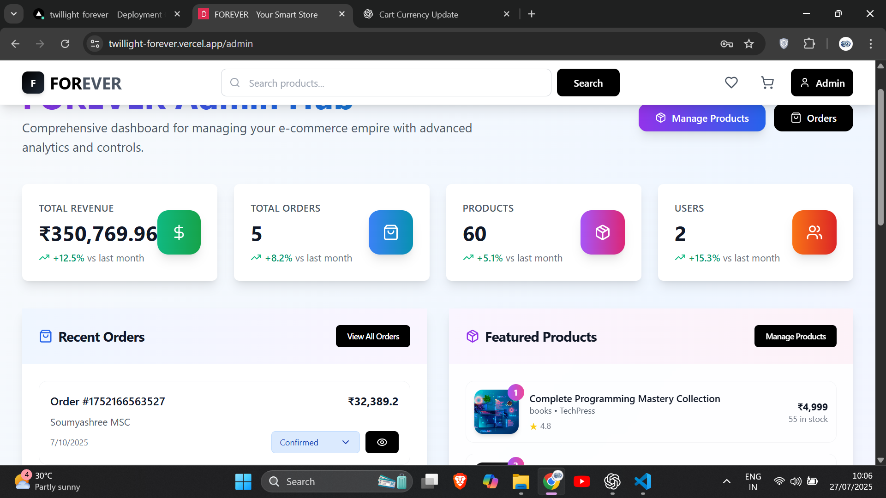 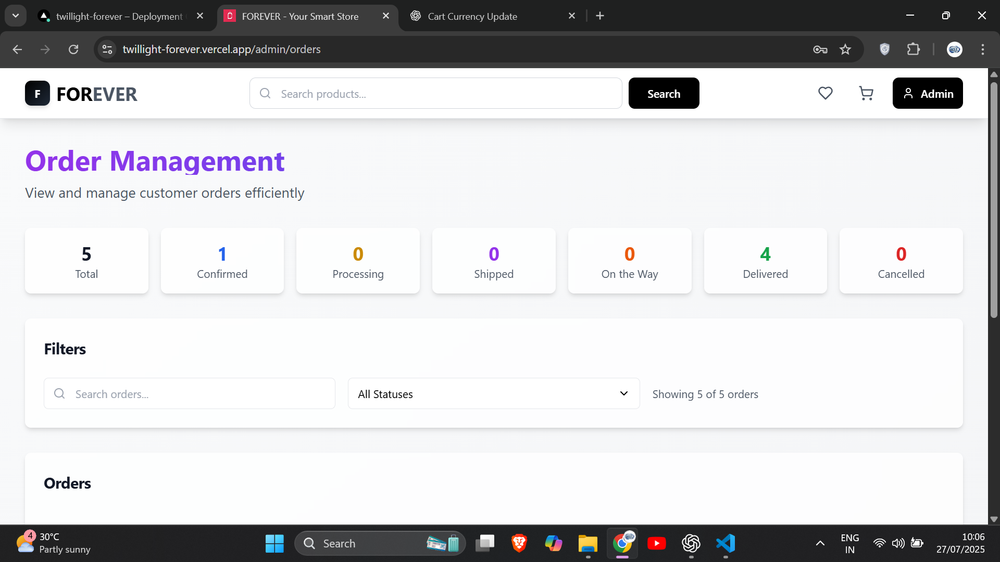 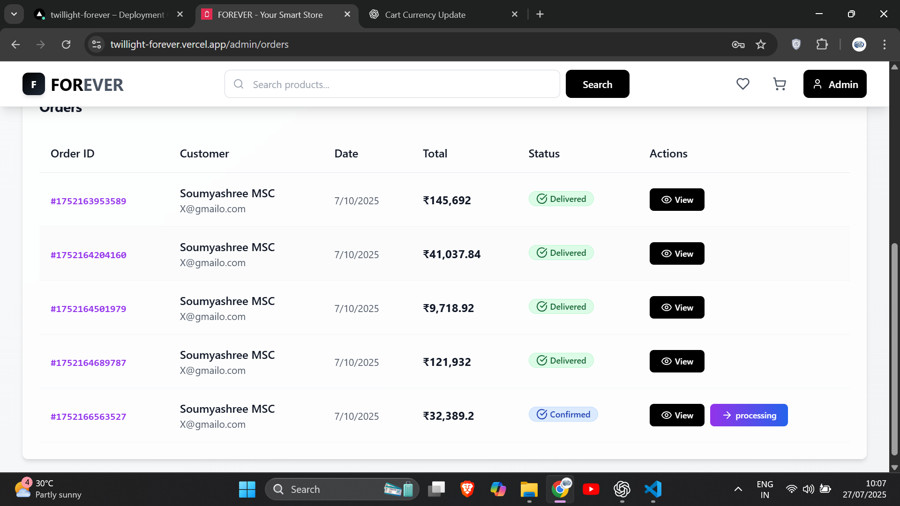 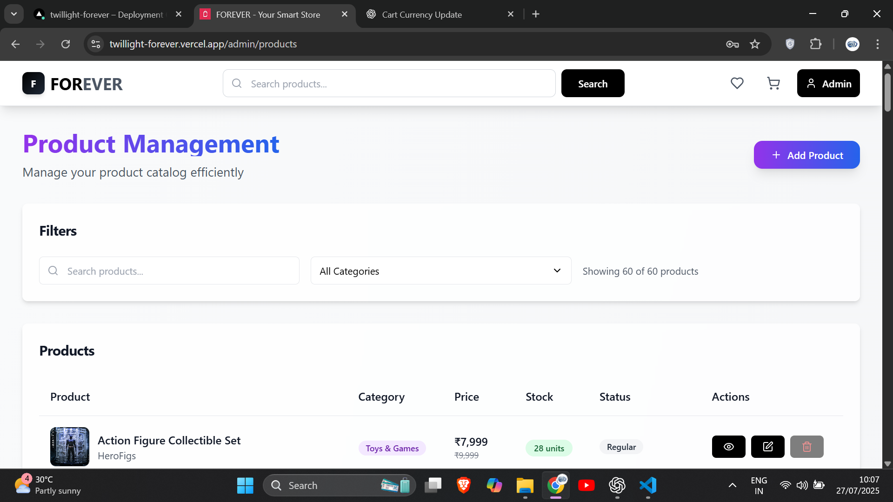 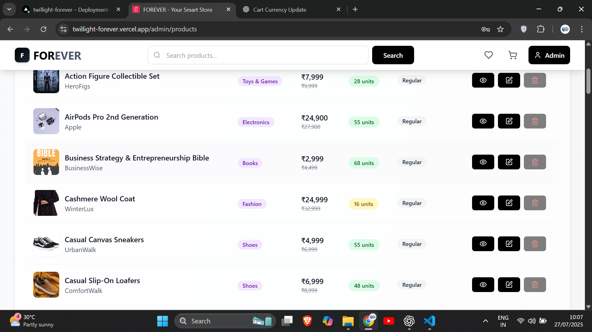  

🏠 Home Page
URL: /
<pre>
Animated hero section using Framer Motion

Links to featured products

Scroll reveal transitions

Dark mode support

Custom font + Tailwind utilities
</pre>

  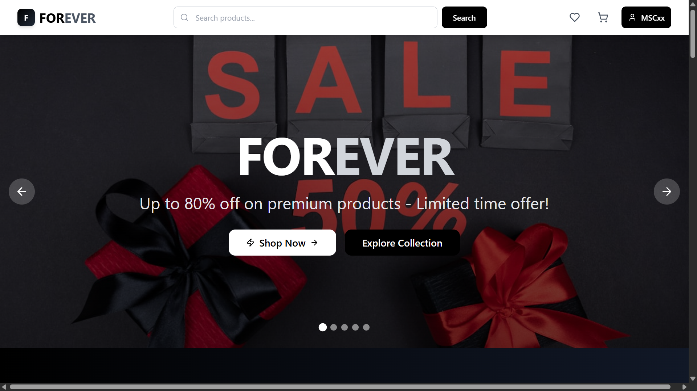  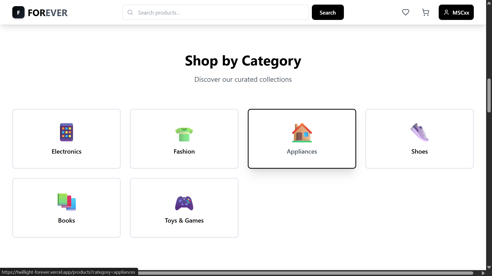    

 Product Page
URL: /product/:id
<pre>
Detailed product information

Add to Cart / Wishlist functionality

Quantity selector

Price display with styling
</pre>

 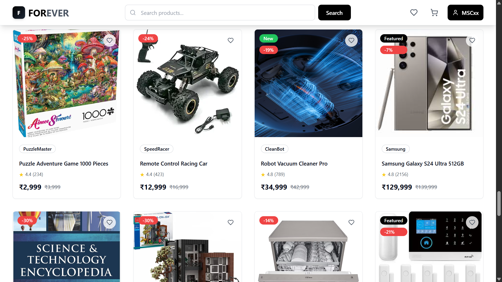 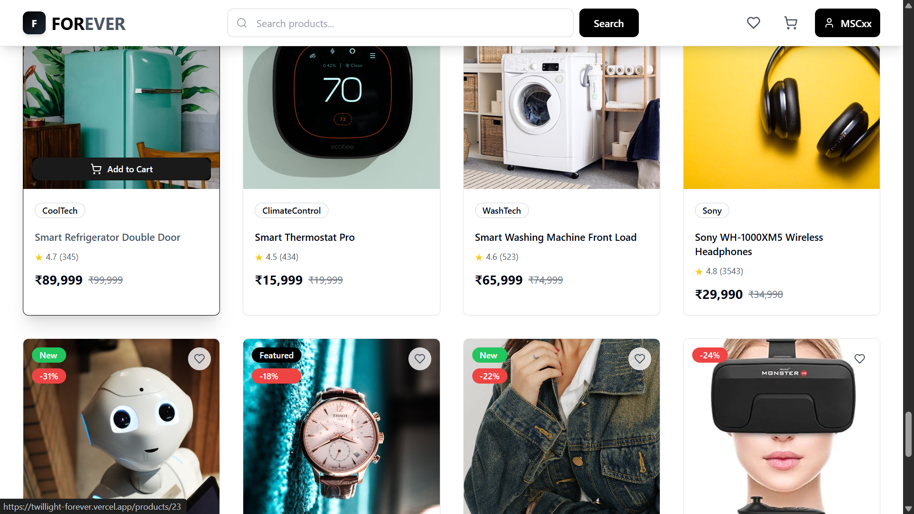 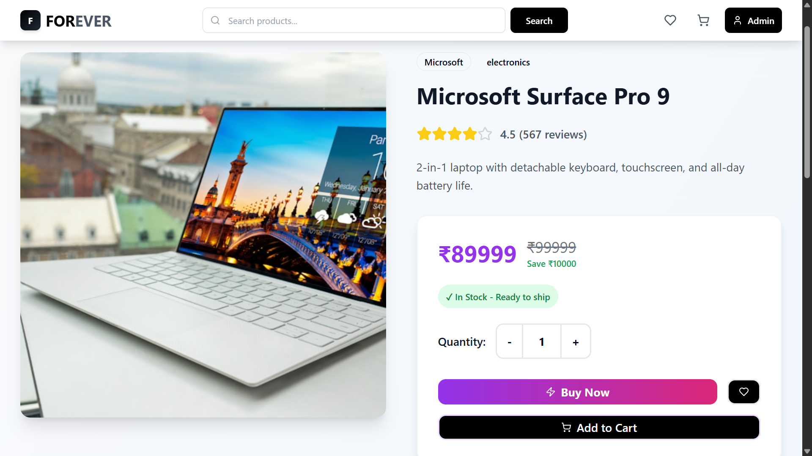 

🔐 Login & Register Pages
URL: /login, /register
<pre>
User authentication via Express backend

JWT-based login system

Form validation

Password encryption using bcrypt.js
</pre>

 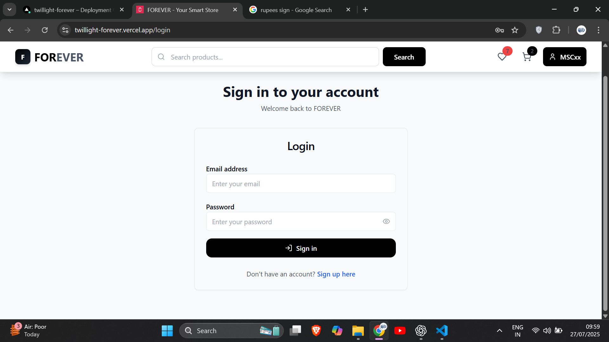  

📋 Order Pages
URL: /orders, /order/:id
<pre>
Order history display

Individual order details (date, price, status)

Receipt download (optional)
</pre>

 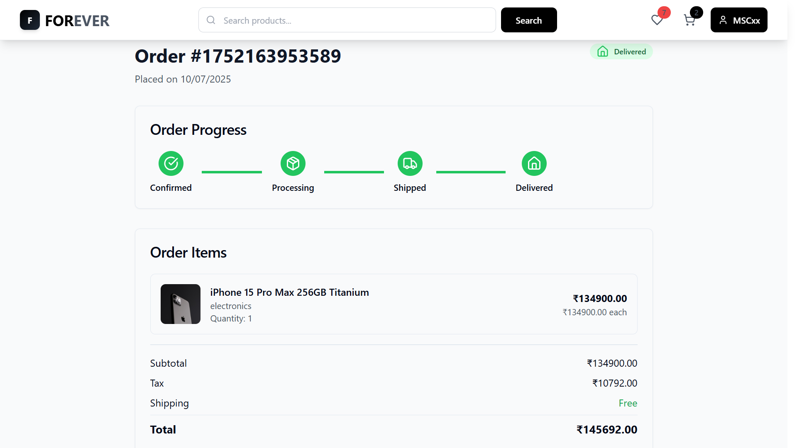 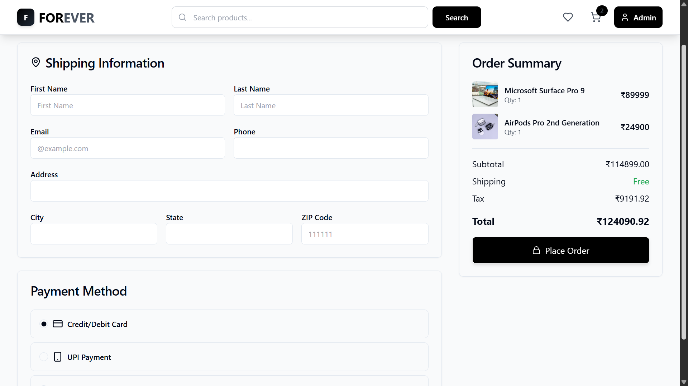 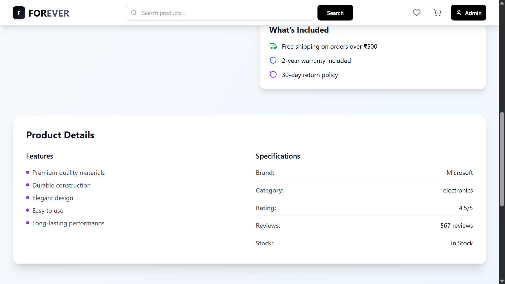 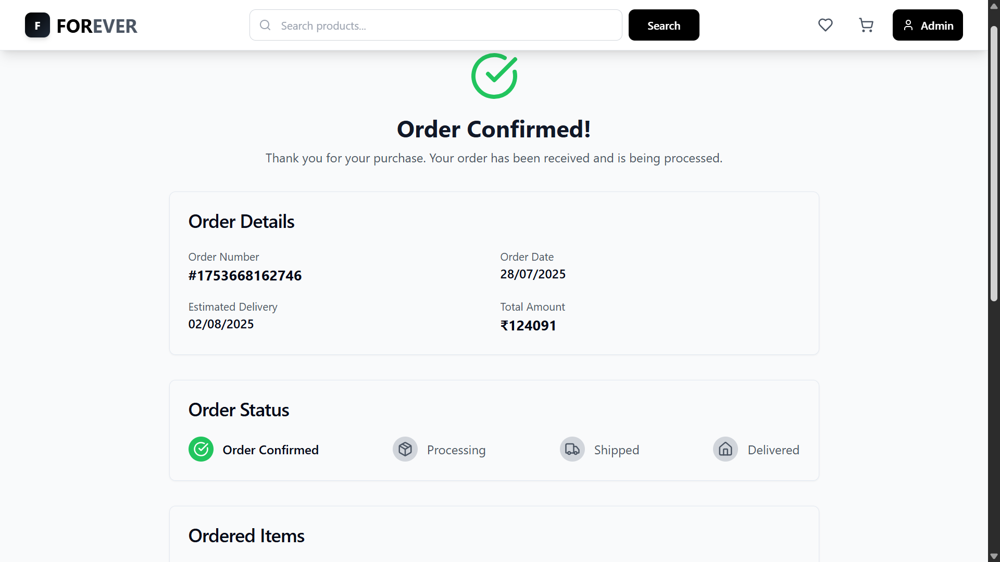 

👤 Profile Page
URL: /profile
<pre>
Displays user data: email, name, etc.

Update user info

View past orders
</pre>

  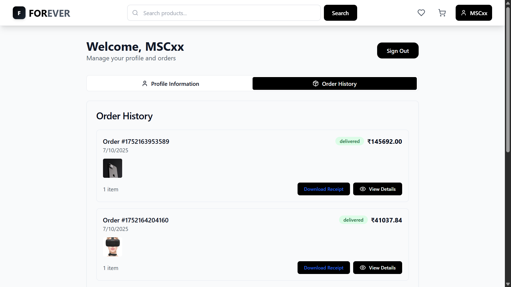 

💖 Cart & Wishlist
URL: /cart, /wishlist
<pre>
Add/remove items

Quantity update controls

Responsive layout

Integrated with product DB
</pre>

   

🛠️ Getting Started
<pre>
Prerequisites
Node.js v16+

MongoDB URI (for .env)

Vite + React project bootstrapped
</pre>
Installation

git clone [https://github.com/MSC-0013/Twillight-FOREVER.git](https://github.com/MSC-0013/Twillight-FOREVER.git)
For Frontend:

<pre>
npm install
npm run dev
</pre>

Then for Backend:

<pre>
cd server
npm install
npm start
</pre>

⚙️ Deployment
Deployed frontend and backend separately:
<pre>
Frontend: Vercel

Backend: Render
</pre>

👤 Author
Soumayshree Rout

🔗 GitHub: @MSC-0013

🌐 Portfolio: [[Portfolio](https://port-folio-tau-coral.vercel.app)]

📬 Contact
📧 Email: <soumyashreerout99@gmail.com>

💼 LinkedIn: [Linkedin Profile](https://www.linkedin.com/in/soumyashree-rout-500671253)
